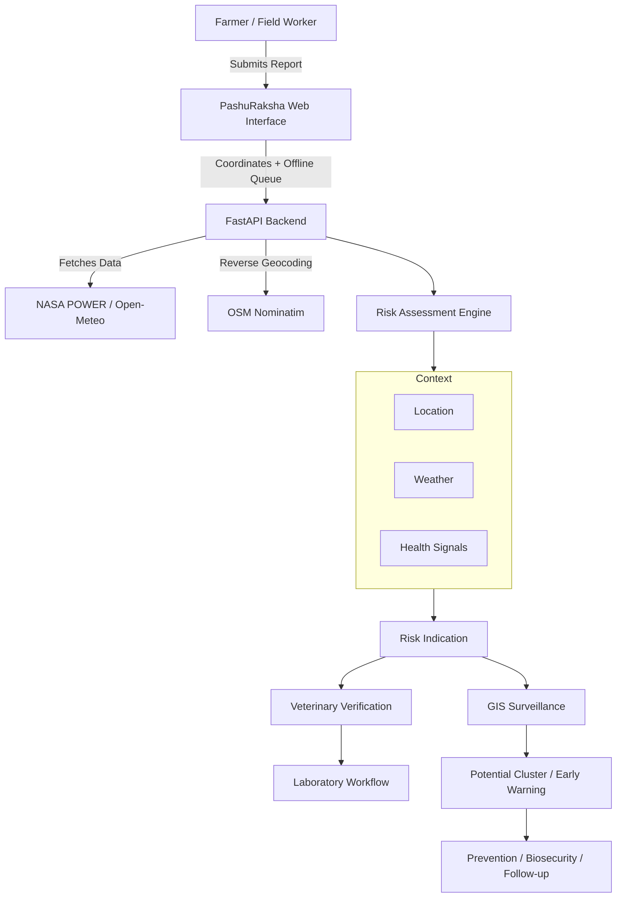

# PASHURAKSHA AI

**AI-Assisted Livestock Health Early-Warning & Outbreak Surveillance Platform**

**Smart India Hackathon 2026**

- **Problem Statement:** SIH26128 — Efficient systems for early detection, prevention, and management of livestock diseases and animal health issues
- **Team:** Tech Titans
- **Institution:** Don Bosco Institute of Technology, Bengaluru

---

## 1. Executive Summary

PashuRaksha AI is an integrated, AI-assisted livestock health early-warning and surveillance platform designed to help farmers, field veterinarians, laboratories, and authorities identify emerging livestock health risks earlier and coordinate veterinary responses. 

The platform bridges the gap between field-level health observations and professional veterinary intervention by combining automatic geographic and environmental data collection with structured symptom reporting. It generates a **risk indication** based on these signals, passing the information through a streamlined **veterinary verification** and **laboratory confirmation** workflow. The system culminates in a real-time **GIS surveillance** dashboard that alerts authorities to potential health-risk clusters before they escalate into widespread outbreaks.

*Importantly, PashuRaksha AI is a decision-support and surveillance tool. It provides risk signals and early warnings but is NOT intended to replace veterinarians. All risk indications require veterinary verification and laboratory confirmation.*

---

## 2. Problem Statement

Livestock health information is often fragmented, leading to significant delays in disease detection and outbreak response. The practical challenges include:
- **Delayed Reporting:** Farmers may report symptoms late due to a lack of immediate guidance.
- **Fragmented Surveillance:** Veterinary teams may not immediately see geographically related reports, missing early signals at the district or village level.
- **Missing Context:** Environmental conditions (temperature, humidity, rainfall) strongly influence vector-borne and respiratory livestock health risks but are rarely recorded alongside symptom reports.
- **Disconnected Workflows:** Laboratory referrals and results are often disconnected from initial field reporting.
- **Infrastructure Constraints:** Rural connectivity can be unreliable, preventing timely digital reporting.

Early detection and coordinated response matter because delayed intervention allows infectious livestock diseases to spread rapidly, threatening animal welfare, farmer livelihoods, and regional agricultural economies.

---

## 3. Proposed Solution

PashuRaksha AI addresses these challenges through a unified, end-to-end workflow:

1. **Farmer Report:** The farmer initiates a health report, entering animal details and observed symptoms.
2. **Automatic Location Detection:** The system automatically captures GPS coordinates and derives the district/village.
3. **Environmental / Weather Data:** The system fetches real-time environmental context (temperature, humidity, rainfall) for the detected location.
4. **Risk Assessment:** A prototype risk engine evaluates the health and environmental signals.
5. **Risk Indication:** The system returns a risk score (LOW, MODERATE, HIGH, CRITICAL) along with immediate biosecurity guidance.
6. **Veterinary Verification:** The report enters a pending queue where a veterinarian reviews the case.
7. **Laboratory Referral & Result:** If necessary, the vet requests a sample. The laboratory processes it and records the result back to the specific case.
8. **GIS Surveillance:** All reports map dynamically to a GIS dashboard.
9. **Early Warning:** Spatial analysis identifies geographic concentrations of reports as a "Potential Health-Risk Cluster".
10. **Prevention & Biosecurity:** The system provides ongoing educational guidance for prevention and follow-up.

---

## 4. Core Innovation

The core innovation of PashuRaksha AI is not simply "disease prediction." Rather, it is the **seamless integration** of multiple contextual signals and workflows:

- Automatic geolocation + Environmental context + Livestock health reporting
- A unified risk indication engine
- Human-in-the-loop veterinary verification
- Integrated laboratory workflow
- Dynamic GIS surveillance and cluster-based early warning
- Offline-first reporting architecture
- Multilingual interface tailored for regional usability
- Actionable prevention and biosecurity guidance

---

## 5. Automatic Location & Environment

PashuRaksha AI automatically enriches every farmer report with geographic and environmental context.

**Location Detection:**
The system uses browser Geolocation API to obtain coordinates and reverse-geocodes them (via Nominatim OSM) to determine the exact **District** and **Village / Locality**.

**Environmental Context:**
Using the detected coordinates, the backend dynamically queries environmental data APIs (NASA POWER / Open-Meteo) to retrieve:
- Environmental Temperature
- Relative Humidity
- Rainfall
- Wind Speed
- Weather Condition

*Note: The system clearly distinguishes between "Environmental temperature" (automatically retrieved) and "Animal body temperature" (manually entered by the farmer).*

---

## 6. Risk Indication Engine & Score

The Risk Indication Engine evaluates incoming reports to generate a preliminary assessment.

**Architecture:**
The engine combines multiple signals:
- Reported symptoms
- Animal information
- Environmental conditions (e.g., high humidity/rainfall increasing vector-borne risks)
- Disease knowledge rules

**Risk Score Calculation:**
The engine outputs a **prototype risk indication score** on a scale of 0–100. This score is calculated using weighted symptom matching (70% base weight) combined with environmental factor modifiers (e.g., +8% for vector/rainfall combinations). 

The numeric score directly maps to a Risk Level:
- **0–29:** LOW
- **30–59:** MODERATE
- **60–79:** HIGH
- **80–100:** CRITICAL

*Important Limitation: This is a prototype risk indication score based on rules and available signals, not a clinically validated ML probability model. The system explicitly states: "Risk indication is not a diagnosis. Veterinary examination and laboratory confirmation remain authoritative."*

---

## 7. Disease Knowledge & Prevention Matrix

The platform maintains a database of candidate health risks and relevant disease knowledge. Currently represented candidates include:
- **Foot & Mouth Disease (FMD)**
- **Lumpy Skin Disease (LSD)**
- **Black Quarter (BQ)**
- **Hemorrhagic Septicemia (HS)**
- **Mastitis**

For each candidate, the system provides:
- Possible risk signals and relevant symptoms
- Prevention guidance
- Biosecurity guidance
- Vaccination information (where applicable)

These profiles are presented strictly as "Candidate health risks" and "Relevant disease knowledge," not as automatic diagnoses.

---

## 8. Workflow: Veterinary Verification & Laboratory

PashuRaksha AI keeps veterinarians firmly in the clinical decision loop.

**Veterinary Verification:**
- New farmer reports appear in the Veterinary Verification dashboard as "Pending Review".
- The veterinarian reviews the Case ID, Location, Symptoms, Risk Indication, Animal Information, and Environmental data.
- The vet can choose to **Verify Case** (adding clinical notes) or **Request Sample** (forwarding the case to the lab).

**Laboratory Workflow:**
- Cases requiring samples move to the Laboratory dashboard.
- Lab personnel can view the pending sample request.
- Once processed, the lab personnel can click **Enter Result**, linking the positive/negative outcome back to the original case ID and updating the global status.

---

## 9. GIS Surveillance & Early Warning

The GIS Surveillance dashboard provides spatial awareness for outbreak prevention.

**Map Implementation:**
The system uses a robust **Leaflet.js** map backed by **OpenStreetMap** tiles. It dynamically plots actual, report-derived coordinates.

**Features:**
- **Risk Markers:** Each case is marked on the map with a color corresponding to its risk level (🟢 Low, 🟡 Moderate, 🟠 High, 🔴 Critical).
- **Marker Popups:** Clicking a marker reveals the Case ID, Location, Risk Level, Risk Signal, Animal, and Status.
- **Cluster Detection:** When multiple reports originate from the same district or geographic area, the system identifies it as a **"Potential Health-Risk Cluster"**.
- **Alert Generation:** The cluster triggers a visual alert recommending immediate "Veterinary investigation".

*Note: A cluster is an emerging surveillance signal, not a confirmed disease outbreak.*

---

## 10. Offline-First Capability & Multilingual Support

**Offline-First Reporting:**
To accommodate rural areas with unreliable connectivity, the farmer report module functions completely offline. Reports submitted without an internet connection are saved locally (via `localStorage`/Service Workers) to an **Offline Queue**. When connectivity returns, the farmer can synchronize the pending reports with the backend server.

**Multilingual Interface:**
The architecture supports multilingual UI switching to ensure regional accessibility. The current prototype implements:
- English
- Kannada
- Hindi
*(Note: Core navigation and forms are translated; dynamic backend disease responses currently remain in English).*

---

## 11. Prevention & Veterinary Care

The platform includes a dedicated **Prevention & Care** section focusing on:
- Biosecurity measures
- Isolation guidance
- Vaccination schedules

*Disclaimer: Any ethnoveterinary or herbal formulations listed in the database are provided strictly as "Educational/reference information only and not a substitute for veterinary diagnosis or treatment."*

---

## 12. System Architecture

---

## 13. Technical Stack

- **Frontend:** HTML5, Tailwind CSS, TypeScript, Vite
- **Backend:** Python, FastAPI, Uvicorn
- **Database:** In-memory prototype persistence (`REPORTS_DB`), structured Pydantic models
- **GIS:** Leaflet.js, OpenStreetMap Tiles
- **External APIs:** NASA POWER (Weather), Open-Meteo (Weather Fallback), Nominatim (Geocoding)
- **Offline Storage:** Browser `localStorage`, Service Worker architecture
- **Testing:** Pytest (Backend)

---

## 14. Datasets & AI/ML Methodology

**Methodology:**
The current AI/ML component consists of **prototype risk rules and weighted environmental signals**. It evaluates symptom combinations and environmental thresholds (e.g., rainfall driving vector-borne risk). 

**Datasets Used for Rules:**
- **NASA POWER Climatology:** Used dynamically to fetch environmental context for risk modifiers.
- **Disease Symptom Matrices:** Curated internal matrices defining weighted symptom associations for livestock diseases (FMD, LSD, BQ, etc.).

*Limitation:* The current risk engine relies on deterministic research-data signals and expert rules. It is not a clinically validated probability model trained on large-scale real-time farm-level clinical data.

---

## 15. Security & Privacy

The prototype implements structural backend separation of concerns:
- **Input Validation:** Strict Pydantic schemas validate all incoming API payloads.
- **CORS Configuration:** Restricts API access to authorized frontend origins.
- **Role Workflows:** Distinct UI routes and state transitions separate Farmer, Veterinarian, and Laboratory actions (logical separation in prototype).

*(Production security features like JWT authentication, database encryption, and role-based access control (RBAC) are slated for future implementation).*

---

## 16. End-to-End Demo Scenario

1. **Farmer opens PashuRaksha AI:** The interface loads, supporting offline capabilities.
2. **Location is automatically detected:** GPS coordinates map to a specific District/Locality.
3. **Weather is retrieved:** Temperature, humidity, and rainfall are logged automatically.
4. **Farmer selects symptoms:** E.g., "High Fever", "Blisters".
5. **System generates risk indication:** The engine calculates a score (e.g., "HIGH — 75/100") and displays candidate signals (e.g., FMD-related) alongside the disclaimer that it is NOT a diagnosis.
6. **Veterinarian reviews the case:** The case appears in the Vet Verification tab.
7. **Veterinarian requests a sample:** The vet forwards the case to the lab.
8. **Laboratory processes the sample:** The Lab tab shows a pending sample, which is then updated with a positive/negative result.
9. **GIS dashboard maps the case:** A red marker appears on the Leaflet map at the exact coordinates.
10. **Cluster forms:** As more reports arrive from the same area, a "Potential Health-Risk Cluster" alert is generated, recommending veterinary investigation.

---

## 17. Expected Impact & Feasibility

**Expected Impact:**
- **Earlier Reporting:** Digital, offline-capable reporting lowers the barrier for farmers.
- **Geographic Visibility:** GIS mapping turns isolated field reports into visible regional health signals.
- **Workflow Coordination:** Unifies farmers, vets, and labs into a single communication pipeline.

**Feasibility:**
The technical feasibility is high, leveraging established open-source tools (FastAPI, Leaflet) and accessible APIs. Operational feasibility in low-connectivity rural environments is explicitly addressed by the Offline Queue architecture. 

---

## 18. Limitations

- The prototype risk indication is based on heuristic rules and environmental modifiers, and is **not clinically validated**.
- The GIS surveillance maps are based entirely on submitted report coordinates; they do not represent official government outbreak declarations.
- Multilingual coverage is currently limited to core UI elements; dynamic disease descriptions remain in English.
- The laboratory and veterinary workflows are logical prototypes; real-world deployment requires integration with official government laboratory LIMS systems.
- Browser-level E2E testing (e.g., Cypress/Playwright) remains a limitation of the current prototype.

---

## 19. Future Enhancements

- Training ML models on larger, validated livestock clinical datasets.
- Integrating official administrative GIS boundary polygons (shapefiles).
- Direct API integration with State Veterinary Department databases.
- Integration of IoT ear-tag sensors for automatic animal body temperature logging.
- Adding IVR/WhatsApp/SMS chatbot support for farmers without smartphones.
- Production deployment with full RBAC authentication.

---

## 20. Conclusion

PashuRaksha AI demonstrates a comprehensive, integrated livestock health early-warning and surveillance workflow rather than a standalone, isolated "disease-diagnosis" tool. 

By connecting **Farmer reporting + Automatic location/environment context + Risk indication + Veterinary verification + Laboratory workflow + GIS surveillance + Offline capability**, the platform serves as a powerful decision-support and surveillance network. It ensures that critical health signals are identified early while keeping professional veterinarians firmly in the clinical decision loop.

---

## 21. References

1. **NASA POWER Project:** Prediction of Worldwide Energy Resources, used for real-time environmental and weather parameter retrieval. (https://power.larc.nasa.gov/)
2. **Open-Meteo API:** Used as a highly available fallback for real-time weather data. (https://open-meteo.com/)
3. **OpenStreetMap & Nominatim:** Used for reverse geocoding coordinates into districts/villages and providing the GIS base map tiles. (https://www.openstreetmap.org/)
4. **Leaflet.js:** Open-source JavaScript library for mobile-friendly interactive maps. (https://leafletjs.com/)
5. **Government of India / SIH:** Smart India Hackathon Problem Statement SIH26128 reference guidelines.
